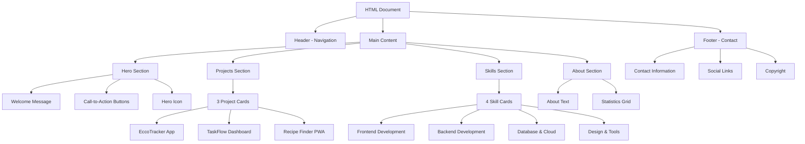

# Portfolio Website - Alex Chen

A modern, responsive portfolio website showcasing full-stack development projects and skills.

## 🎨 Layout Structure



## 📋 Section Breakdown

### 1. **Header - Navigation Bar**

```
┌─────────────────────────────────────────────────┐
│  🔧 Alex Chen    Home | Projects | Skills | ... │
└─────────────────────────────────────────────────┘
```

- **Purpose**: Primary navigation for the entire site
- **Features**:
  - Brand logo with developer icon
  - Responsive navigation menu
  - Smooth scroll links to all sections
  - Dark slate background with white text
- **HTML5 Element**: `<header>` with `<nav>`

---

### 2. **Hero Section** (Landing)

```
┌─────────────────────────────────────────────────┐
│                                                 │
│  Welcome to My Digital Playground       💻    │
│  I'm Alex Chen, a passionate...                │
│  [View My Work] [Download Resume]              │
│                                                 │
└─────────────────────────────────────────────────┘
```

- **Purpose**: First impression and introduction
- **Features**:
  - Gradient background (indigo to purple)
  - Two-column responsive layout
  - Call-to-action buttons
  - Large laptop icon visualization
- **Design**: Eye-catching gradient with prominent typography
- **HTML5 Element**: `<section>` within `<main>`

---

### 3. **Projects Section**

```
┌─────────────────────────────────────────────────┐
│           Featured Projects                     │
│                                                 │
│  ┌──────────┐  ┌──────────┐  ┌──────────┐    │
│  │ 🍃 Ecco  │  │ ✓ Task   │  │ 🍴 Recipe│    │
│  │ Tracker  │  │ Flow     │  │ Finder   │    │
│  │ [Tags]   │  │ [Tags]   │  │ [Tags]   │    │
│  │ [Links]  │  │ [Links]  │  │ [Links]  │    │
│  └──────────┘  └──────────┘  └──────────┘    │
└─────────────────────────────────────────────────┘
```

- **Purpose**: Showcase portfolio projects
- **Features**:
  - 3-column grid layout (responsive)
  - Color-coded headers (green, blue, yellow)
  - Technology tags for each project
  - Links to live site and GitHub
- **Projects**:
  1. **EccoTracker App** - Carbon footprint tracking with React, MongoDB, D3.js
  2. **TaskFlow Dashboard** - Project management with Vue.js, Express.js, Socket.io
  3. **Recipe Finder PWA** - Recipe suggestions with JavaScript, Service Workers, Firebase
- **HTML5 Element**: `<section>` with `<article>` cards

---

### 4. **Skills Section**

```
┌─────────────────────────────────────────────────┐
│          My Technical Arsenal                   │
│                                                 │
│  ┌──────┐  ┌──────┐  ┌──────┐  ┌──────┐      │
│  │ 📱   │  │ 🖥️   │  │ 💾   │  │ 🎨   │      │
│  │Front │  │Back  │  │Data  │  │Design│      │
│  │end   │  │end   │  │base  │  │Tools │      │
│  └──────┘  └──────┘  └──────┘  └──────┘      │
└─────────────────────────────────────────────────┘
```

- **Purpose**: Display technical competencies
- **Features**:
  - 4-column grid layout (responsive: 2 cols on tablet, 1 on mobile)
  - Large icon for each category
  - Detailed technology lists
  - Hover effects with shadow
- **Categories**:
  1. **Frontend Development** - HTML5, CSS3, React, Vue.js, TypeScript, Tailwind CSS
  2. **Backend Development** - Node.js, Express.js, Python, Django, GraphQL
  3. **Database & Cloud** - MongoDB, PostgreSQL, Firebase, AWS, Docker
  4. **Design & Tools** - Figma, Adobe XD, Responsive Design, Accessibility
- **HTML5 Element**: `<section>` with `<article>` cards

---

### 5. **About Section**

```
┌─────────────────────────────────────────────────┐
│  About Me                   ┌────┐  ┌────┐    │
│                             │ 3+ │  │25+ │    │
│  Hi! I'm Alex, a            │Yrs │  │Proj│    │
│  full-stack developer...    └────┘  └────┘    │
│                             ┌────┐  ┌────┐    │
│  My journey began...        │98% │  │150+│    │
│                             │Sat │  │Git │    │
│  When I'm not coding...     └────┘  └────┘    │
└─────────────────────────────────────────────────┘
```

- **Purpose**: Personal introduction and credibility
- **Features**:
  - Two-column layout
  - Personal narrative on left
  - Statistics grid on right
  - Professional metrics
- **Statistics**:
  - 3+ Years Experience
  - 25+ Projects Completed
  - 98% Client Satisfaction
  - 150+ GitHub Contributions
- **HTML5 Element**: `<section>` within `<main>`

---

### 6. **Footer - Contact Section**

```
┌─────────────────────────────────────────────────┐
│     Let's Build Something Amazing Together      │
│                                                 │
│   📧 Email    📱 Phone    📍 Location  🔗 Social│
│                                                 │
│   ────────────────────────────────────────────  │
│   © 2024 Alex Chen. Crafting digital...        │
└─────────────────────────────────────────────────┘
```

- **Purpose**: Contact information and social links
- **Features**:
  - Dark slate background (matches header)
  - 4-column contact grid
  - Social media navigation with ARIA labels
  - Copyright information
- **Contact Methods**:
  - Email: alex.chen.dev@example.com
  - Phone: (555) 123-4567
  - Location: San Francisco, CA
  - Social: LinkedIn, GitHub, Twitter, Dribbble
- **HTML5 Element**: `<footer>` with semantic `<nav>` for social links

---

## 🛠️ Technologies Used

- **HTML5**: Semantic markup with proper document structure
- **Tailwind CSS v4**: Utility-first CSS framework via CDN
- **Font Awesome 7.0.0**: Icon library for visual elements
- **Responsive Design**: Mobile-first approach with breakpoints
- **Accessibility**: ARIA labels and semantic HTML for screen readers

## 📱 Responsive Breakpoints

- **Mobile**: < 768px (single column layouts)
- **Tablet**: 768px - 1024px (md: prefix, 2-3 columns)
- **Desktop**: > 1024px (lg: prefix, full layouts)

## 🎯 Design Features

- **Color Scheme**:
  - Primary: Indigo (#4F46E5) and Purple gradients
  - Accent: Various project-specific colors
  - Background: Gray-50 and White alternating sections
- **Typography**:
  - Font stack: System font sans-serif
  - Headings: Bold, 2xl to 5xl sizes
  - Body: Gray-600, readable line height

- **Interactions**:
  - Hover effects on cards and buttons
  - Smooth color transitions
  - Shadow elevation on hover
  - Responsive navigation

## 📁 File Structure

```
MainProject/
├── src/
│   ├── portfolio.html    # Main HTML file
│   ├── style.css        # Custom styles (if any)
│   └── assets/          # Images and media
├── public/              # Static assets
├── package.json         # Project dependencies
├── vite.config.ts       # Vite configuration
└── README.md           # This file
```

## 🚀 Getting Started

1. Open `portfolio.html` in a modern web browser
2. All styles are loaded via CDN (no build step required)
3. Customize content, colors, and links as needed

## ✨ Key Highlights

- **Semantic HTML5**: Proper use of `<header>`, `<main>`, `<article>`, `<section>`, `<footer>`
- **Accessibility**: ARIA labels on icons and navigation elements
- **Performance**: CDN-loaded assets, minimal dependencies
- **Maintainability**: Clean structure with Tailwind utility classes
- **SEO-Friendly**: Semantic markup improves search engine indexing

---

**Developer**: Alex Chen  
**Last Updated**: August 2026  
**License**: Personal Portfolio Project
